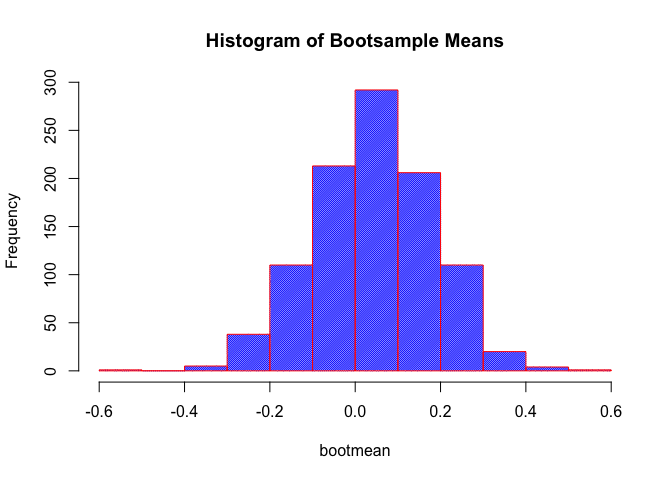
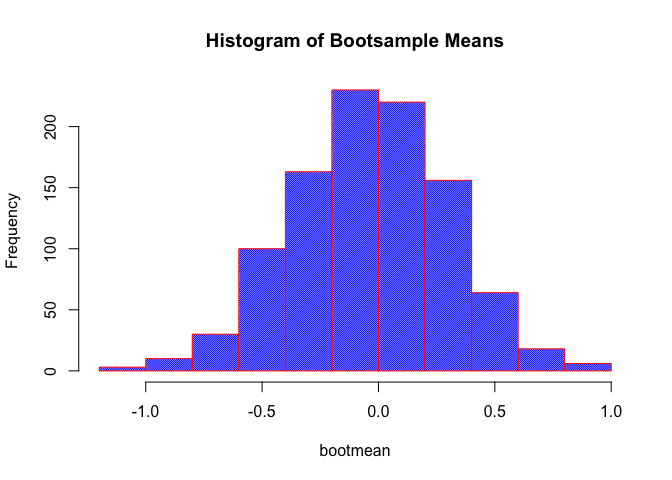
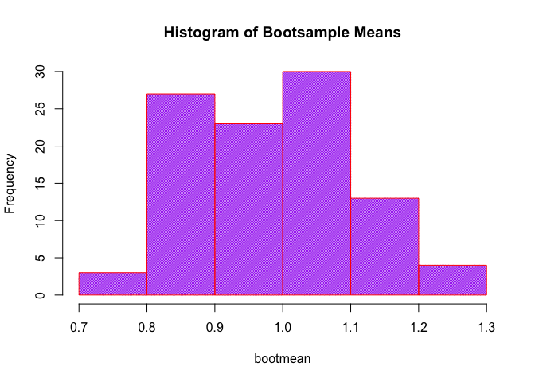
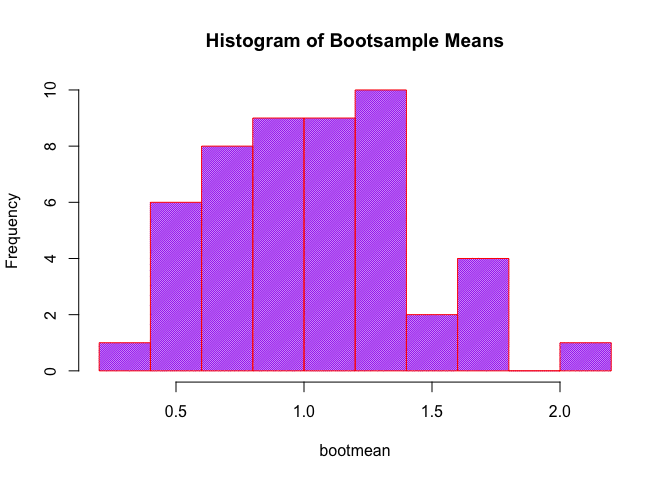
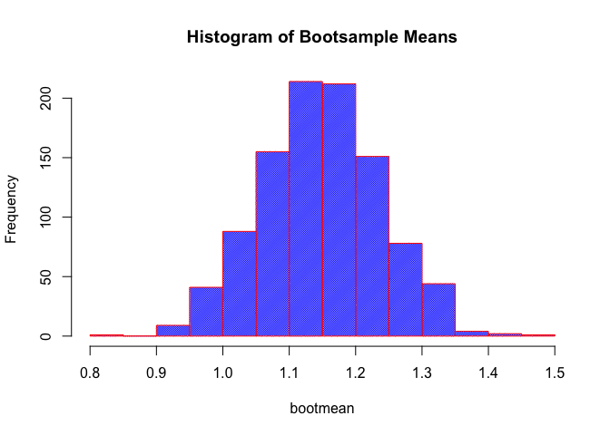
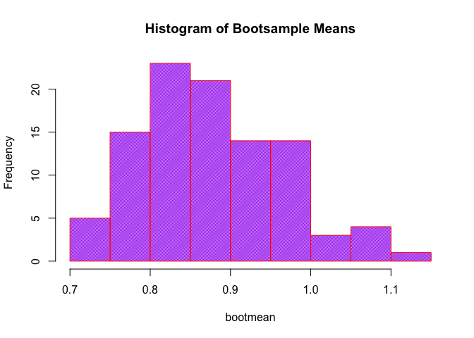
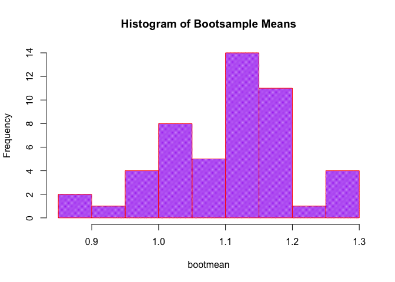

# Doing Data Science
*Trace Smith*
*Homework #4*


##### Normal Distribution - One Sample:


```r
#create a bootstrap function
bootstrap1<- function(d,r,n){ #pass arguments d,r,n
  norm <- rnorm(d) #random normal distribution with #d observations
  bootmean <- numeric(r) #initialize bootmean vector 
  #loop through "r" times and sample from "norm" with replacement "n" times
  for(i in 1:r){
    boot.sample <- sample(norm,n,replace=TRUE) #replace = TRUE
    bootmean[i] <- mean(boot.sample) #take the average of samples
  }
  #create histogram of bootstrap means
  hist(bootmean, density=70, main=paste("Histogram of Bootsample Means"), 
       border="red",col="blue", axes=TRUE) #add color and border 
}
```


```r
#call bootstrap function; passing 100 observations to generate a normal distribution
#loop through 1000 times (1,000 different bootstraps), sample size of 50
bootstrap1(100,1000,50)
```

<!-- -->


```r
#call bootstrap function
bootstrap1(100,1000,10)
```

<!-- -->

##### Exponential Distribution - One Sample:


```r
#create a bootstrap function
bootstrap2<- function(d,r,n){ #pass arguments d,r,n
  expo <- rexp(d) #random exponential distribution with #d observations
  bootmean <- numeric(r) #initialize bootmean vector 
  #loop through "r" times and sample from "norm" with replacement "n" times
  for(i in 1:r){
    boot.sample <- sample(expo,n,replace=TRUE) #replace = TRUE
    bootmean[i] <- mean(boot.sample) #take the average of samples
  }
  #create histogram of bootstrap means
  hist(bootmean, density=70, main=paste("Histogram of Bootsample Means"),
       border="red",col="purple", axes=TRUE) # add color and border
}
```


```r
#call bootstrap function
bootstrap2(100,100,50)
```

<!-- -->


```r
#call bootstrap function
bootstrap2(100,50,10)
```

<!-- -->

##### Normal Distribution - Two Samples:

```r
#create a bootstrap function
bootstrap3<- function(d,r,n){ #pass arguments d,r,n
  group1 <- rnorm(d) #random normal distribution with #d observations
  group2 <- rnorm(d) #random normal distribution with #d observations
  bootmean <- numeric(r) #initialize bootmean vector 
  #loop through "r" times and sample from "norm" with replacement "n" times
  for(i in 1:r){
    # subtract the each group; the difference will be normally distributed
    boot.sample <- abs(sample(group1,n,replace=TRUE)-sample(group2,n,replace=TRUE))
    bootmean[i] <- mean(boot.sample)
  }
  #create histogram of bootstrap means
  hist(bootmean, density=70, main=paste("Histogram of Bootsample Means"),
       border="red",col="blue", axes=TRUE)
}
```

```r
#call bootstrap function
bootstrap3(100,1000,100)
```

<!-- -->


```r
#call bootstrap function
bootstrap3(10,100,50)
```

<!-- -->


##### Exponential Distribution - Two Samples:


```r
#create a bootstrap function
bootstrap4<- function(d,r,end,n){#pass arguments d,r,n
  group1 <- rexp(d) #random exponential distribution with #d observations
  group2 <- rexp(d) #random exponential distribution with #d observations
  bootmean <- numeric(r) #initialize bootmean vector 
  #loop through "r" times and sample from "norm" with replacement "n" times
  for(i in 1:r){
    #subtract difference
    boot.sample <- abs(sample(group1,n,replace=TRUE)-sample(group2,n,replace=TRUE))
    bootmean[i] <- mean(boot.sample)
  }
  #create histogram of bootstrap means
  hist(bootmean, density=70, main=paste("Histogram of Bootsample Means"),
       border="red",col="purple", axes=TRUE)
}
```


```r
#call bootstrap function
bootstrap4(100,100,50)
```

<!-- -->


```r
#call boostrap function
bootstrap4(100,50,10)
```

<!-- -->
