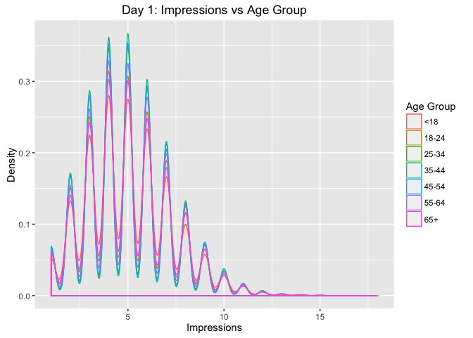

# Unit 10 Live Session
Trace Smith  
11/12/2016  

<br>


##### Download Data

- [Data Source](http://stat.columbia.edu/~rachel/datasets)


```r
#Function to download each csv file from URL
mydownload <- function(start,end){
  num <- seq(start,end,by=1)
  for (i in 1:length(num)){
    string_num <- as.character(num[i])
    url <- paste0("http://stat.columbia.edu/~rachel/datasets/nyt",string_num,".csv")
    file <- paste0("Data/nyt",string_num,".csv")
    download.file(url,destfile = file)
  }
}
```


```r
#call the download function and pass the range for file names
mydownload(1,1)
```

<br>

#### Read CSV file into Data.Frame

```r
mydata <- function(name,start,end){
  t1 <- proc.time()
  #read first file to create variables in data frame and headers
  d1<- read.csv(paste0(name,"1",".csv",sep=""),header=TRUE)
  num <- seq(start,end,by=1)
  for(i in 1:length(num)){
    string_num <- as.character(num[i])
    file <- paste0(name,string_num,".csv",sep="")
    d1<-rbind(d1,read.csv(file=file))
  }
  total <- proc.time() - t1
  print(cat("Dimensions:",dim(d1),sep=" "))
  print(cat("Run Time:",total,sep=" "))
  return(d1)
}
```


```r
#call mydata function and pass file name, start and end date:
df<-mydata("Data/nyt",1,1)
```

```
## Dimensions: 916882 5NULL
## Run Time: 1.895 0.064 1.965 0 0NULL
```


```r
#Remove any rows with NA for Age
df<-df[!(is.na(df$Age)), ]
```


```r
#Remove any row observations with age = 0
df <- df[-which(df$Age == 0),]
head(df,10)
```

```
##    Age Gender Impressions Clicks Signed_In
## 1   36      0           3      0         1
## 2   73      1           3      0         1
## 3   30      0           3      0         1
## 4   49      1           3      0         1
## 5   47      1          11      0         1
## 6   47      0          11      1         1
## 8   46      0           5      0         1
## 9   16      0           3      0         1
## 10  52      0           4      0         1
## 12  21      0           3      0         1
```

** Histogram** 

```r
#Create histogram of age distribution 
hist(df$Age,freq=FALSE,xlab="Age",col="navy",border="white",
     main="Histogram of Age")
```

<!-- -->

** Create a new variable ageGroup that categorizes age into following groups: < 18, 18–24, 25–34, 35–44, 45–54, 55–64 and 65+.**


```r
df$ageGroup <- cut(df$Age,c(-Inf,18,24,34,44,54,64,Inf))
#cut function creates a factor with levels
levels(df$ageGroup) <- c("<18","18-24","25-34","35-44","45-54","55-64","65+")
knitr::kable(head(df,3))
```


 Age   Gender   Impressions   Clicks   Signed_In  ageGroup 
----  -------  ------------  -------  ----------  ---------
  36        0             3        0           1  35-44    
  73        1             3        0           1  65+      
  30        0             3        0           1  25-34    

** Use sub set of data called “ImpSub” where Impressions > 0 ) in your data set.**


```r
#Subset the data; new object "ImpSub"
ImpSub <- subset(df,Impressions>0)
```

**Create a new variable called click-through-rate (CTR = click/impression).**


```r
ImpSub$CTR <- round(ImpSub$Clicks/ImpSub$Impressions,4)
```

#### Using ImpSub data set to do further analysis

**Plot distributions of number impressions and click-through-rate (CTR = click/impression) for the age groups.**


```r
library(ggplot2)
p<- ggplot(ImpSub,aes(x=Impressions,colour=ageGroup)) + geom_density()
p+labs(title="Day 1: Impressions vs Age Group", # add title
       x="Impressions",y="Density",colour="Age Group") 
```

<!-- -->

** Define a new variable to segment users based on click -through-rate (CTR) behavior. CTR< 0.2, 0.2<=CTR <0.4, 0.4<= CTR<0.6, 0.6<=CTR<0.8, CTR>0.8 **


```r
ImpSub$CTR_Segments <- cut(ImpSub$CTR,c(0,0.2,0.4,0.6,0.8,Inf))
levels(ImpSub$CTR_Segments) <- c("<0.20","0.20-0.40","0.40-0.60","0.60-0.80",">0.80")
```

** Get the total number of Male, Impressions, Clicks and Signed_In (0=Female, 1=Male) **


```r
#Convert Numeric to Male/Female:
ImpSub$Gender[ImpSub$Gender == "0"] <- "Female"
ImpSub$Gender[ImpSub$Gender == "1"] <- "Male"
```


```r
sum_stats <- aggregate(ImpSub[c("Impressions","Clicks","Signed_In")],by=list(ImpSub$Gender),FUN=sum)
colnames(sum_stats) <- c("Gender","Total Impressions","Clicks","Signed_In")
knitr::kable(sum_stats)
```


Gender    Total Impressions   Clicks   Signed_In
-------  ------------------  -------  ----------
Female              1534598    22384      304104
Male                1685554    23554      334292


```r
#Subset for Sign In and Males
ImpSub.Male <- subset(ImpSub,Gender=="Male",Signed_In=1)
head(ImpSub.Male)
```

```
##    Age Gender Impressions Clicks Signed_In ageGroup CTR CTR_Segments
## 2   73   Male           3      0         1      65+   0         <NA>
## 4   49   Male           3      0         1    45-54   0         <NA>
## 5   47   Male          11      0         1    45-54   0         <NA>
## 17  40   Male           3      0         1    35-44   0         <NA>
## 18  31   Male           5      0         1    25-34   0         <NA>
## 21  59   Male           4      0         1    55-64   0         <NA>
```


** Get the mean of Age, Impressions, Clicks, CTR and percentage of males and signed_In **


```r
sum_stats <- aggregate(ImpSub.Male[c("Impressions","Clicks","Signed_In")],by=list(ImpSub.Male$Gender),FUN=sum)
colnames(sum_stats) <- c("Gender","Avg Impressions","Avg Clicks","Signed_In")
knitr::kable(sum_stats)
```


Gender    Avg Impressions   Avg Clicks   Signed_In
-------  ----------------  -----------  ----------
Male              1685554        23554      334292

** Get the means of Impressions, Clicks, CTR and percentage of males and signed_In  by AgeGroup.**


```r
Age_stats <- aggregate(ImpSub.Male[c("Impressions","Clicks","CTR")], by=list(ImpSub.Male$ageGroup) ,FUN=mean)
colnames(Age_stats) <- c("AgeGroup","Impressions","Avg Clicks","CTR")
knitr::kable(Age_stats)
```


AgeGroup    Impressions   Avg Clicks         CTR
---------  ------------  -----------  ----------
<18            5.029481    0.1331542   0.0267546
18-24          5.038776    0.0487779   0.0096335
25-34          5.015252    0.0503740   0.0101118
35-44          5.062919    0.0522322   0.0103325
45-54          5.044957    0.0500178   0.0097540
55-64          5.055308    0.1028535   0.0202456
65+            5.028825    0.1528005   0.0297096

** Create a table of CTRGroup vs AgeGroup counts.**


**One more plot you think which is important to look at.**


```r
p <- ggplot(ImpSub.Male,aes(x=ageGroup,y=mean(CTR),fill=ageGroup)) + geom_bar(stat="identity") 
p+labs(title="Males: Age Group vs Avg. CTR", # add title
       x="Age Group",y="Mean CTR",colour="Age Group")  
```

<!-- -->
