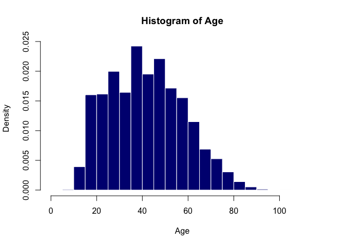
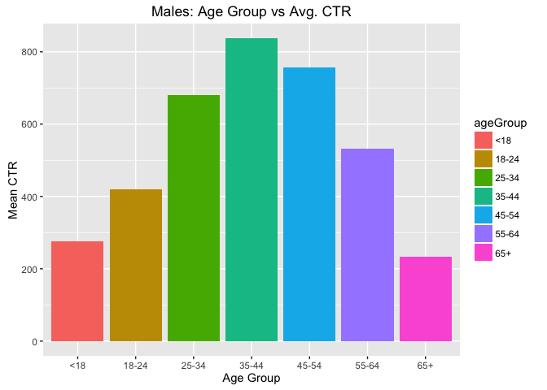

# Unit 10 Live Session
Trace Smith  
11/12/2016  

<br>


**Download Data**

- [Data Source](http://stat.columbia.edu/~rachel/datasets)


```r
#Function to download each csv file from URL
mydownload <- function(start,end){
  num <- seq(start,end,by=1) #initialize vector from start to end by 1's; 1xn dimensions
  for (i in 1:length(num)){# iterate from 1 to length of num
    string_num <- as.character(num[i])#convert number to character
    url <- paste0("http://stat.columbia.edu/~rachel/datasets/nyt",string_num,".csv") #concate URL name
    filepath <- paste0("Data/nyt",string_num,".csv") #concate file name
    download.file(url,destfile = filepath) #download file from URL and save to filepath
  }
}
```


```r
#There are 31 files from  http://stat.columbia.edu/~rachel/datasets are formatted from nyt1.csv to nyt31.csv.
#Call the mydownload function and pass the range for file names. 
mydownload(1,2) #download files nyt1.csv thru nyt(n).csv. 
```

**Read CSV file into Data.Frame**

```r
mydata <- function(name,start,end){
  t1 <- proc.time()#starting time for code to execute
  #read first file to create variables in data frame and headers
  d1<- read.csv(paste0(name,"1",".csv",sep=""),header=TRUE)
  num <- seq(start,end,by=1)#initialize vector from start to end by 1's; 1xn dimensions
  for(i in 1:length(num)){# iterate from 1 to length of num
    string_num <- as.character(num[i]) #convert number to character
    file <- paste0(name,string_num,".csv",sep="") #concate file name
    d1<-rbind(d1,read.csv(file=file))#combine the data from each csv file into one data.frame
  }
  total <- proc.time() - t1 #total elapsed run time
  print(cat("Dimensions:",dim(d1),sep=" ")) #dimensions of the data.frame
  print(cat("Run Time:",total,sep=" ")) #print total run time
  return(d1) #return the data.frame `d1`
}
```


```r
#Call mydata function and pass file name, start and end date. 
#For this work, we will only look at the first 2 files.
df<-mydata("Data/nyt",1,2)
```

```
## Dimensions: 722979 5NULL
## Run Time: 1.647 0.055 1.707 0 0NULL
```


```r
#Remove any rows with NA for Age
df<-df[!(is.na(df$Age)), ]
```


```r
#Remove any row observations with Age = 0
df <- df[-which(df$Age == 0),]
head(df)
```

```
##   Age Gender Impressions Clicks Signed_In
## 1  36      0           3      0         1
## 2  73      1           3      0         1
## 3  30      0           3      0         1
## 4  49      1           3      0         1
## 5  47      1          11      0         1
## 6  47      0          11      1         1
```

**Histogram** 

```r
#Create histogram of age distribution 
hist(df$Age,freq=FALSE,xlab="Age",col="navy",border="white",
     main="Histogram of Age")
```

<!-- -->

**Create a new variable ageGroup that categorizes age into following groups: < 18, 18–24, 25–34, 35–44, 45–54, 55–64 and 65+.**


```r
#create new column "ageGroup" and cut the age column into different intervals
df$ageGroup <- cut(df$Age,c(-Inf,18,24,34,44,54,64,Inf))
#cut function creates a factor with levels; rename intervals
levels(df$ageGroup) <- c("<18","18-24","25-34","35-44","45-54","55-64","65+")
head(df,3)
```

```
##   Age Gender Impressions Clicks Signed_In ageGroup
## 1  36      0           3      0         1    35-44
## 2  73      1           3      0         1      65+
## 3  30      0           3      0         1    25-34
```

**Use sub set of data called “ImpSub” where Impressions > 0.**


```r
#Subset the data; new object "ImpSub"
ImpSub <- subset(df,Impressions>0)
```

**Create a new variable called click-through-rate (CTR = click/impression). Note will use ImpSub data set to do the further analysis**


```r
# CTR = Clicks/No. Impressions
ImpSub$CTR <- round(ImpSub$Clicks/ImpSub$Impressions,4)
```

**Plot distributions of number impressions and click-through-rate (CTR = click/impression) for the age groups.**


```r
#Load the ggplot2 package
library(ggplot2)
# plot the impressions vs ageGroup (density plot)
p<- ggplot(ImpSub,aes(x=Impressions,colour=ageGroup)) + geom_density()
p+labs(title="Day 1: Impressions vs Age Group", # add title
       x="Impressions",y="Density",colour="Age Group") 
```

<!-- -->

**Define a new variable to segment users based on click -through-rate (CTR) behavior. CTR< 0.2, 0.2<=CTR <0.4, 0.4<= CTR<0.6, 0.6<=CTR<0.8, CTR>0.8**


```r
#segment users based on click -through-rate (CTR) b
ImpSub$CTR_Segments <- cut(ImpSub$CTR,c(0,0.2,0.4,0.6,0.8,Inf))
#cut function creates a factor with levels; rename intervals
levels(ImpSub$CTR_Segments) <- c("<0.20","0.20-0.40","0.40-0.60","0.60-0.80",">0.80")
```

**Get the total number of Male, Impressions, Clicks and Signed_In (0=Female, 1=Male)**


```r
#Convert Numeric to Male/Female:
ImpSub$Gender[ImpSub$Gender == "0"] <- "Female"
ImpSub$Gender[ImpSub$Gender == "1"] <- "Male"
```


```r
#Subset for Sign In (i.e. =1) and Males
ImpSub.Male <- subset(ImpSub,Gender=="Male",Signed_In=1)
```


```r
#aggregate data and count the total number of Male, Impressions, Clicks and Signed_In 
sum_stats <- aggregate(ImpSub.Male[c("Impressions","Clicks","Signed_In")],by=list(ImpSub.Male$Gender),FUN=sum)
colnames(sum_stats) <- c("Gender","Total Impressions","Clicks","Signed_In") #rename columns
sum_stats
```

```
##   Gender Total Impressions Clicks Signed_In
## 1   Male           1340827  18841    266135
```

**Get the mean of Age, Impressions, Clicks, CTR and percentage of males and signed_In**


```r
#aggregate and compute the average Age, Impressions, Clicks, CTR and percentage of males and signed_In
sum_stats <- aggregate(ImpSub.Male[c("Impressions","Clicks","Signed_In")],by=list(ImpSub.Male$Gender),FUN=sum)
colnames(sum_stats) <- c("Gender","Avg Impressions","Avg Clicks","Signed_In") #rename columns
sum_stats
```

```
##   Gender Avg Impressions Avg Clicks Signed_In
## 1   Male         1340827      18841    266135
```

**Get the means of Impressions, Clicks, CTR and percentage of males and signed_In  by AgeGroup.**


```r
#aggregate and compute the average Impressions, Clicks, CTR and percentage of males and signed_In by AgeGroup
Age_stats <- aggregate(ImpSub.Male[c("Impressions","Clicks","CTR")], by=list(ImpSub.Male$ageGroup) ,FUN=mean)
colnames(Age_stats) <- c("AgeGroup","Impressions","Avg Clicks","CTR") #rename columns
Age_stats
```

```
##   AgeGroup Impressions Avg Clicks         CTR
## 1      <18    5.038721 0.13801514 0.027040073
## 2    18-24    5.034530 0.05102417 0.010037474
## 3    25-34    5.031578 0.04892166 0.009818747
## 4    35-44    5.035230 0.05105976 0.010091537
## 5    45-54    5.040085 0.05185776 0.010348556
## 6    55-64    5.054160 0.10187313 0.020242139
## 7      65+    5.030858 0.15188810 0.030078087
```

**Create a table of CTRGroup vs AgeGroup counts.**
- Columns: Age Group 
- Rows: Click Through Rate Segements


```r
count.group <- table(ImpSub$CTR_Segments, ImpSub$ageGroup) #table CTR_Segment vs AgeGroup
count.group
```

```
##            
##              <18 18-24 25-34 35-44 45-54 55-64  65+
##   <0.20     2665  1997  3094  3973  3501  4717 4224
##   0.20-0.40  987   685  1080  1329  1241  1724 1747
##   0.40-0.60  181    91   149   184   194   272  254
##   0.60-0.80    8     5     6     5     1    15   17
##   >0.80       16    24    38    29    37    63   36
```

**Additional Exploratory Analysis**


```r
#plot the ageGrop vs the mean click through rate (CTR) and fill by ageGroup (bar plot)
p <- ggplot(ImpSub.Male,aes(x=ageGroup,y=mean(CTR),fill=ageGroup)) + geom_bar(stat="identity") 
p+labs(title="Males: Age Group vs Avg. CTR", # add title
       x="Age Group",y="Mean CTR",colour="Age Group")  #add labels
```

<!-- -->
